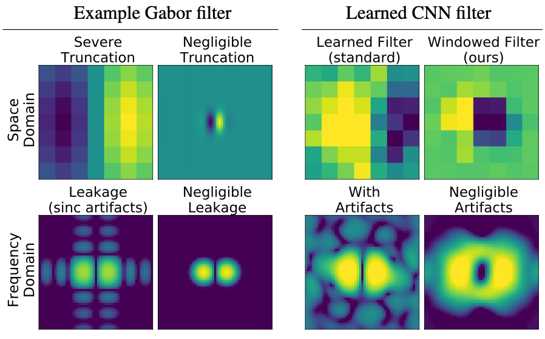
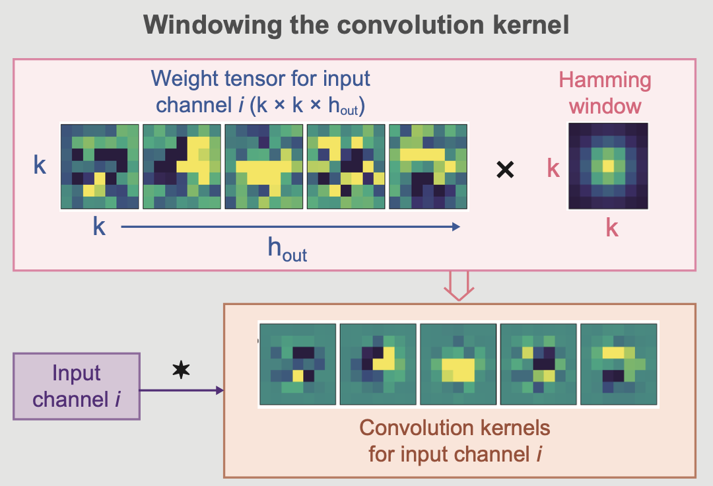
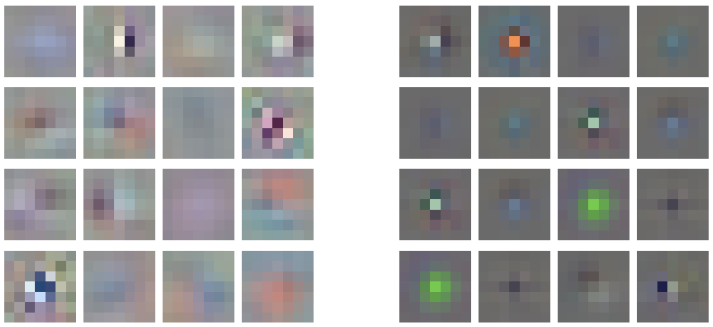

# Spectral Leakage and Rethinking the Kernel Size in CNNs


This is an unofficial Pytorch implementation of https://arxiv.org/abs/2101.10143

Interesting application of classical signal processing to CNN architecture’s building block.

## Non leaking (or Hamming) conv
### A little theory 

The main idea of the paper as I understood: because of the small kernel size (3x3) in modern CNN and the "sharp" 
window - artefacts in frequency domain arise. To fix this, the authors suggest using a bigger kernel size (7x7) 
with a Hamming window which makes the "border" of the kernel not so "sharp". At a high level - this is just a kind of a regularization, where the kernel weights are pushed to have bigger values in the center.

Why do artifacts arise? Citate from the paper:
> The finite size of the discrete kernel, within which the filter assumes non-zero values, represents a
> multiplication of an infinite kernel and a rectangular function in space domain, which translates as a
> convolution with a sinc function in frequency domain .. the rectangular function introduces windowing artifacts 
> to the frequency response in the form of ‘ripples’ of the sinc function.

### Practise


The implementation of non leaking conv layer - [non_leaking_conv.py](non_leaking_conv.py)

I tried to keep torchvision's ResNet structure as much as possible and so I used slightly different structure than 
paper. In general I replaced all the 3x3 conv2d with Hamming 7x7 conv2d. Also I tried to do a fair comparison 
with the baseline ResNet - change the width multiplier to match the total amount of weights for different models 
(since the model with increasing kernel size has more params). I also tried a spatial factorization.

## Implementation results
### Training
Example for a training factorized non leaking model with the same number of weights as in the baseline:
```bash
python train.py  --experiment_name 7x7_hamming_factorized --kernel 7 --padding 3 --factorized --wm 0.78125 --hamming
```

### Visualization of the learned kernels
On the left are baseline kernels, on the right are kernels kernels with Hamming(non leaking) conv. Baseline - resnet18 7x7, first level kernels. From [notebook](LearnedKernelsEDA.ipynb).



### ResNet18 on CIFAR10
ResNet18 without the first maxpool and stride=2 in the first conv (CIFAR size adjustment).

#### Without matching the total amount of weights
|           |ResNet  |ResNet-Factorized|ResNet-7x7|ResNet-7x7-Hamming|
|:----------|:-------|:----------------|:---------|:-----------------|
|accuracy(%)|**93.2**|92.0             |91.7      |**93.2**          | 
|weights(K) |11,173  |8,039            |60,005    |60,005            | 

#### With matching the total amount of weights
I haven't found details of the author's comparisons with equal amounts of total weights, which looks more fair to 
me (there is a "wide" model, but it's not clear for me).

|           |ResNet  |ResNet-7x7|ResNet-7x7-Factorized|ResNet-7x7-Hamming|ResNet-7x7-Hamming-Factorized|
|:----------|:-------|:---------|:--------------------|:-----------------|:----------------------------|
|accuracy(%)|**93.2**|90.4      |91.2                 |92.2              |92.0                         |
|weights(K) |11,173  |11,491    |11,300               |11,491            |11,300                       |
|*width mult|1.0     |0.4375    |0.78125              |0.4375            |0.78125                      |

*width mult - channel width multiplier (coefficient to reduce the number of weights by multiplying it by the number 
of channels in conv2d)

### ImageNet
TODO

## Questions
It seems that the authors didn't make the number of parameters in the baseline and in their model equal for a fair 
comparison.

# Citations
```bibtex
@misc{tomen2021spectral,
      title={Spectral Leakage and Rethinking the Kernel Size in CNNs}, 
      author={Nergis Tomen and Jan van Gemert},
      year={2021},
      eprint={2101.10143},
      archivePrefix={arXiv},
      primaryClass={cs.CV}
}
```